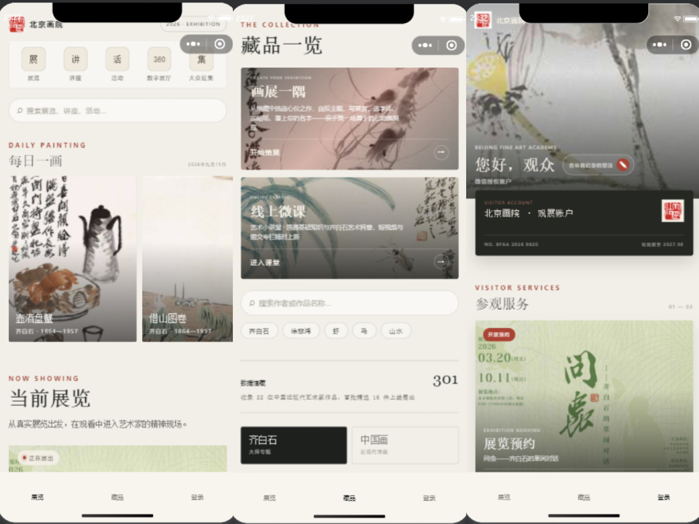

# 美术馆微信小程序

> 面向美术馆数字化展示场景，设计并开发的一套微信小程序数字展陈系统，实现艺术作品展示、展览信息管理、用户收藏、观展记录等功能，为传统艺术展览提供数字化展示与互动体验。
---
### 小程序整体界面

以下为项目实际运行效果展示：


## 一、项目简介

随着数字技术在文化场馆中的应用不断深入，传统展览逐渐从单一线下展示向“线上线下一体化”的数字展陈模式发展。

本项目以画院艺术资源为基础，围绕美术馆数字化展示需求，搭建微信小程序端数字展陈系统。

系统通过采集、整理和结构化艺术作品、展览等公开信息，结合微信小程序交互能力，实现：

- 艺术作品数字化展示
- 展览信息浏览
- 用户收藏管理
- 观展记录沉淀
- 观众互动反馈

提升用户线上观展体验，为文化机构数字化运营提供应用基础。

---

# 二、项目目标

## 1. 艺术资源数字化展示

将传统纸质或线下展示内容转化为结构化数字资源：

- 艺术家信息
- 作品信息
- 展览信息
- 作品图片资源

形成可管理、可查询的艺术数据资源库。


## 2. 提升用户观展体验

通过微信小程序提供：

- 展览提前浏览
- 作品在线查看
- 收藏感兴趣内容
- 记录个人观展感受


## 3. 探索数字展陈应用模式

结合：

- 数据采集
- 信息管理
- 移动端展示
- 用户交互

探索传统艺术展览与数字技术结合的实现方式。

---

# 三、系统功能

## 1. 首页展示模块

### 功能

提供数字展陈入口，包括：

- 当前展览推荐
- 藏品展示入口
- 新闻资讯
- 用户个人中心


### 实现效果

帮助用户快速进入：

- 作品浏览
- 展览查看
- 收藏管理

等核心功能。

---

# 2. 艺术作品展示模块

## 功能介绍

展示艺术作品数字资源，包括：

- 作品图片
- 作者信息
- 创作年代
- 作品尺寸
- 作品介绍


## 数据结构

示例：

```json
{
    "title": "作品名称",
    "author": "艺术家",
    "year": "创作年代",
    "size": "作品尺寸",
    "description": "作品介绍"
}
````

---

# 3. 展览展示模块

## 功能介绍

实现线上展览信息展示，包括：

* 展览名称
* 展览时间
* 展览地点
* 展览介绍
* 展览作品列表

用户可以通过小程序提前了解展览内容，提高线下参观体验。

---

# 4. 收藏管理模块

## 功能介绍

支持用户收藏：

* 喜爱的艺术作品
* 感兴趣的展览

方便用户建立个人艺术浏览记录。

---

# 5. 观展笔记模块

## 功能介绍

针对线下观展场景设计互动功能。

用户可以：

* 选择观展时间
* 添加文字记录
* 上传现场图片
* 查看历史笔记

实现从“观看展览”到“记录体验”的用户闭环。

---

# 6. 新闻资讯模块

## 功能介绍

展示文化机构相关动态：

* 展览通知
* 艺术活动
* 新闻资讯

帮助用户持续获取展览信息。

---

# 四、系统架构

整体采用前后端分离设计：

```
用户端
  |
  |
微信小程序
(TypeScript + WXML + WXSS)
  |
  |
数据接口服务
  |
  |
结构化艺术数据
```

---

# 五、技术栈

## 前端

| 技术         | 用途      |
| ---------- | ------- |
| 微信小程序      | 移动端应用开发 |
| TypeScript | 页面逻辑开发  |
| WXML       | 页面结构    |
| WXSS       | 页面样式    |
| JSON       | 数据配置    |

## 后端（可选）

| 技术            | 用途     |
| ------------- | ------ |
| Python        | 数据处理   |
| Flask/FastAPI | 数据接口服务 |

## 数据处理

| 技术       | 用途    |
| -------- | ----- |
| Python爬虫 | 数据采集  |
| JSON     | 数据存储  |
| 数据清洗     | 信息结构化 |

---

# 六、数据流程

```
北京画院公开数据

        ↓

数据采集

        ↓

数据清洗

        ↓

结构化处理

        ↓

艺术资源数据库

        ↓

微信小程序展示
```

---

# 七、项目目录结构

```
bjaa-digital-exhibition-miniapp

│
├── miniprogram/
│   ├── pages/
│   ├── components/
│   ├── utils/
│   └── app.ts
│
├── admin/
│   └── 管理后台代码
│
├── server/
│   └── 后端接口服务
│
├── assets/
│   └── 图片资源说明
│
├── screenshots/
│   └── 项目截图
│
├── app.json
├── app.wxss
├── project.config.json
├── tsconfig.json
│
└── README.md
```

---

# 八、数据与资源说明

## 数据来源

项目艺术作品及展览信息来源于公开艺术机构网站信息。

通过：

* 数据采集
* 数据清洗
* 字段整理

形成结构化艺术数据。

## 图片资源

由于项目涉及大量艺术作品及展览图片：

* 图片数量较多
* 文件体积较大
* 部分资源存在版权限制

因此未将完整图片资源上传至 GitHub。

完整运行时，需要将图片资源放入：

```
assets/
```

目录示例：

```
assets/

├── artworks/
│   └── 作品图片

├── exhibitions/
│   └── 展览图片

└── user_notes/
    └── 用户上传图片
```

---

# 九、本地运行

## 1. 下载项目

```bash
git clone 项目地址
```

## 2. 配置资源文件

将图片资源放入：

```
assets/
```

## 3. 微信开发者工具打开项目

打开：

```
project.config.json
```

## 4. 编译运行

使用微信开发者工具：

```
编译 → 预览 → 调试
```

---

# 十、项目亮点

## 1. 面向真实文化场景的数字化应用

结合美术馆、艺术展览实际需求，实现：

* 艺术资源数字化
* 展览信息管理
* 用户互动体验

## 2. 艺术数据结构化管理

将非结构化艺术信息整理为：

* 作品数据
* 艺术家数据
* 展览数据

支持后续数字资源管理与扩展。

## 3. 用户互动闭环设计

通过：

浏览 → 收藏 → 参观 → 记录

形成完整用户体验流程。

---

# 十一、未来优化方向

## 1. AR辅助观展

结合AR技术：

* 艺术作品信息增强展示
* 历史背景讲解

## 2. 智能导览

结合AI模型：

* 个性化路线推荐
* 艺术作品智能介绍

## 3. 数字展厅扩展

支持：

* 大屏展示
* 沉浸式投影
* 多媒体互动展示

---

# 十二、项目作者

开发方向：

* 数字展陈系统
* 文化数据管理
* 微信小程序应用开发

```

